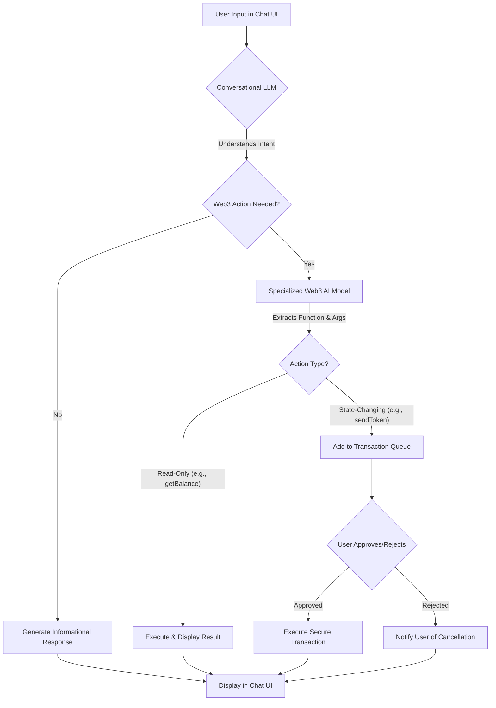

# AxiosChat: Your Intelligent Web3 Navigator

<div align="center">
  
  
  ### *Bridging the gap between complex blockchain technology and everyday users*
</div>

## 🚀 Revolutionizing Your Web3 Experience

**AxiosChat** is a cutting-edge, AI-powered chat interface designed to demystify the complexities of the blockchain. We bridge the gap between the technical world of Web3 and everyday users by enabling seamless interaction with decentralized technologies through intuitive, natural language conversations. Ask questions, execute transactions, and learn about crypto concepts – all within a sleek, responsive, and now **exceptionally robust** chat environment.

<div align="center">
  <table>
    <tr>
      <td><b>The Challenge</b></td>
      <td><b>Our Solution</b></td>
    </tr>
    <tr>
      <td>Web3 presents a steep learning curve with complex jargon, intricate procedures, and fear of errors that create significant barriers to mainstream adoption.</td>
      <td>AxiosChat transforms this landscape by providing a user-friendly gateway to blockchain functionalities, empowering both crypto enthusiasts and newcomers to navigate the decentralized web with confidence.</td>
    </tr>
  </table>
</div>

### 🔗 Live Demo & Pitch

<div align="center">
  <a href="https://axioschat-r2jy.vercel.app/" target="_blank">
    
  </a>
</div>

> **Note:** AI functionality may be limited on the live demo due to API key constraints.

## ✨ Key Features & Recent Enhancements

### 💬 Core Functionality

* **Conversational Blockchain Operations**: Execute transactions (token swaps, transfers) and query data (balances, prices) using simple English.
* **Intelligent Function Calling**: Sophisticated AI determines when to call specific blockchain functions based on your requests.
* **Educational Context**: Learn as you go! AxiosChat provides explanations for blockchain concepts and transaction details.
* **Secure by Design**: Critical operations require user approval via a clear transaction queue, giving you full control.

### 🎨 Enhanced User Interface (New & Improved!)

* **Premium Visual Design**: Stunning gradient effects, micro-interactions, and beautiful transitions create a truly premium experience.
* **Interactive Chat Experience**: Advanced animations for message bubbles, interactive hover states, and smooth transitions between states.
* **Message Management**: Smart organization with pinnable conversations, date grouping, and contextual filtering options.
* **Crystal-Clear Code Formatting**: Improved readability for technical information with syntax highlighting and proper indentation.
* **Responsive Design**: Perfectly adapts to any device, from mobile to desktop.

### 🧠 Interactive Learning Features (New!)

* **Interactive Blockchain Visualization**: Dynamic, animated visualization shows how blocks connect in a chain with real-time interaction.
* **Step-by-Step Blockchain Explanations**: Visually engaging walkthrough of blockchain concepts with animated step indicators.
* **Categorized Learning Prompts**: Intelligently organized suggestions to help users explore different aspects of Web3 technology.
* **Visual Learning Aids**: Animated diagrams and illustrations that make complex concepts easier to understand.

### 🛡️ Unprecedented Robustness (Recent Upgrade!)

* **Graceful Error Handling**: Advanced error boundaries and try-catch blocks prevent UI freezes or crashes.
* **Fallback Mechanisms**: The UI gracefully degrades if optional dependencies (like animation libraries) fail to load, ensuring core functionality remains.
* **Stable Component Architecture**: Refactored key components (`ChatMessages`, `SuggestedPromptsPanel`, `Chat` page) for maximum stability and resilience.

### 🧠 AI Strategy

* **Multi-Model Approach**: Leverages OpenAI's powerful models for conversation and specialized Web3 models (like Flock) for precise function execution.
* **Qwen Integration Powered by Gaia AI**: Now featuring Qwen LLM integration through the Gaia AI decentralized platform for enhanced performance and reduced latency.
* **Configurable AI Backend**: Flexible API integration system allows you to choose your preferred AI provider.
* **Context-Aware Processing**: The system intelligently maintains conversation context to provide more relevant and accurate responses.
* **Optimized Prompting**: Carefully crafted system prompts ensure the AI provides accurate Web3 information and function calls.

## 🏆 Why AxiosChat Stands Out

AxiosChat isn't just another chatbot. It's a **thoughtfully engineered solution** addressing a critical pain point in the Web3 ecosystem: **accessibility**.

<div align="center">
  <table>
    <tr>
      <th>Key Strength</th>
      <th>Why It Matters</th>
    </tr>
    <tr>
      <td><b>Innovation in User Experience</b></td>
      <td>We've created an interface that is not only functional but delightful to use, with polished animations, intuitive categorized prompts, and thoughtful visual design.</td>
    </tr>
    <tr>
      <td><b>Technical Excellence & Reliability</b></td>
      <td>Our investment in robust error handling and graceful degradation ensures a seamless user journey even when encountering unexpected issues - a maturity rarely seen in hackathon projects.</td>
    </tr>
    <tr>
      <td><b>Interactive Learning System</b></td>
      <td>Our innovative visualizations and step-by-step guides transform passive learning into an engaging, interactive experience that makes complex concepts accessible.</td>
    </tr>
    <tr>
      <td><b>Real-World Problem Solving</b></td>
      <td>AxiosChat directly tackles the barriers to Web3 adoption, making complex technology understandable and usable for a broader audience.</td>
    </tr>
    <tr>
      <td><b>Practical Application of AI</b></td>
      <td>We demonstrate a sophisticated, multi-layered AI strategy that intelligently combines different models for optimal performance in a specialized domain.</td>
    </tr>
  </table>
</div>

## 🏗️ Architecture & Information Flow

AxiosChat employs a sophisticated dual-model AI architecture:

1. **Conversational LLM (OpenAI)**: Manages the primary user interaction, understands intent, and determines if a Web3-specific action is required.
2. **Specialized Web3 AI Model (Flock)**: If a Web3 action is needed, this model interprets the request to identify the precise blockchain function and its parameters.

This system intelligently differentiates between:
* **Read-only operations** (e.g., checking a token balance), which can be executed quickly.
* **State-changing operations** (e.g., sending tokens), which are routed to a secure transaction queue for explicit user approval.

<div align="center">
  

</div>

## 💻 Technical Stack Highlights

<div align="center">
  <table>
    <tr>
      <th>Category</th>
      <th>Technologies</th>
    </tr>
    <tr>
      <td>Frontend</td>
      <td>React, TypeScript, Tailwind CSS, Shadcn UI</td>
    </tr>
    <tr>
      <td>State Management</td>
      <td>React Hooks (useState, useEffect, useContext)</td>
    </tr>
    <tr>
      <td>Web3 Interaction</td>
      <td>Wagmi, Ethers.js (via AI service)</td>
    </tr>
    <tr>
      <td>AI Integration</td>
      <td>Custom service layer for interacting with LLMs (OpenAI), Qwen LLM (via Gaia AI), and specialized Web3 models (Flock)</td>
    </tr>
    <tr>
      <td>UI Enhancements</td>
      <td>Framer Motion (with fallbacks), React Syntax Highlighter, date-fns</td>
    </tr>
    <tr>
      <td>Visualizations</td>
      <td>Custom interactive components, SVG animations, and dynamic data visualizations</td>
    </tr>
    <tr>
      <td>Error Handling</td>
      <td>Custom React Error Boundaries with graceful UI degradation</td>
    </tr>
  </table>
</div>

## 🚀 Getting Started

1. **Clone the Repository**:
   ```bash
   git clone https://github.com/OkeyAmy/Axioschat.git
   cd Axioschat
   ```

2. **Install Dependencies**:
   ```bash
   npm install
   ```
   *This will install all required packages including UI enhancements like `framer-motion`, `react-syntax-highlighter`, and `date-fns`.*

3. **Configure Environment Variables**:
   Create a `.env` file in the root directory and populate it with your API keys:
   ```env
   REACT_APP_OPENAI_API_KEY=your_openai_api_key
   REACT_APP_REPLICATE_API_KEY=your_replicate_api_key
   REACT_APP_GAIA_API_KEY=your_gaia_api_key
   # Add other variables as needed
   ```

   **Getting a Gaia API Key:**
   - For testing, you can use Gaia's public endpoint with the default API key:
     ```
     API endpoint: https://llama70b.gaia.domains/v1
     API Key: gaia
     ```
   - For production use, visit [Gaia's website](https://www.gaianet.ai/) to create an account and obtain a dedicated API key
   - Alternatively, you can [run your own Gaia node](https://github.com/GaiaNet-AI/gaianet-node) for complete control and customization

## 🧠 Self-Hosting Qwen LLM via Gaia Node

For users who prefer to run the Qwen LLM locally rather than using public API endpoints, AxiosChat supports integration with self-hosted Gaia nodes. This approach provides enhanced privacy, reduced latency, and complete control over your AI model.

### Setting Up Your Gaia Node with Qwen LLM

1. **Install the Gaia Node Software**:
   ```bash
   curl -sSfL 'https://github.com/GaiaNet-AI/gaianet-node/releases/latest/download/install.sh' | bash
   ```
   Follow the on-screen prompts to complete installation.

2. **Configure for Qwen LLM**:
   Update your node configuration to use Qwen LLM:
   ```bash
   gaianet config --chat-url "https://huggingface.co/gaianet/qwen3-8b-GGUF/resolve/main/qwen3-8b-Q5_K_M.gguf"
   gaianet config --prompt-template "qwen3"
   ```

3. **Initialize and Start Your Node**:
   ```bash
   gaianet init
   gaianet start
   ```
   
4. **Connect AxiosChat to Your Local Node**:
   After starting your node, it will display a URL in the format:
   ```
   https://[node-id].gaia.domains/v1
   ```
   Add this URL to your `.env` file:
   ```
   REACT_APP_GAIA_API_ENDPOINT=https://[node-id].gaia.domains/v1
   REACT_APP_GAIA_API_KEY=gaia
   ```

### Benefits of Self-Hosting

- **Privacy**: Your data remains within your infrastructure
- **Customization**: Fine-tune the model for your specific use cases
- **Reliability**: No dependence on external API availability
- **Cost-effective**: No usage-based API charges for high-volume applications

### System Requirements

To run Qwen LLM models effectively via a Gaia node, the following minimum specifications are recommended:

- **CPU**: 8+ cores
- **RAM**: 16GB minimum (32GB recommended)
- **Storage**: 20GB free space
- **GPU**: NVIDIA GPU with 8GB+ VRAM (optional but recommended for better performance)

For a complete guide to running specialized versions of Qwen (like Qwen Coder) or configuring advanced features, refer to the [Gaia documentation](https://docs.gaianet.ai/).

4. **Run the Development Server**:
   ```bash
   npm run dev
   ```
   The application will be available at `http://localhost:8081` or another port if specified.

## 🔮 Future Roadmap & Vision

* **Phase 1 (Achieved & Enhanced)**: Core conversational AI, Web3 function calling, robust UI, secure transaction handling, support for Ethereum.
* **Phase 2**: Expansion to additional EVM chains (e.g., Polygon, BNB Chain, Arbitrum) and popular L2s.
* **Phase 3**: Deeper DeFi integrations (e.g., interacting with specific lending protocols, yield aggregators via natural language), NFT management.
* **Phase 4**: Browser extension for in-context Web3 assistance and a dedicated mobile application.
* **Phase 5**: Advanced learning path system with customized, interactive tutorials based on user knowledge level and interests.

## 📄 License

This project is licensed under the [MIT License](LICENSE).

---

<div align="center">
  <p>
    <i>Built with 💜 for the blockchain community</i>
  </p>
  <p>
    <a href="https://github.com/OkeyAmy/AxiosChat/issues">Report Bug</a> · 
    <a href="https://github.com/OkeyAmy/AxiosChat/issues">Request Feature</a>
  </p>
</div>
